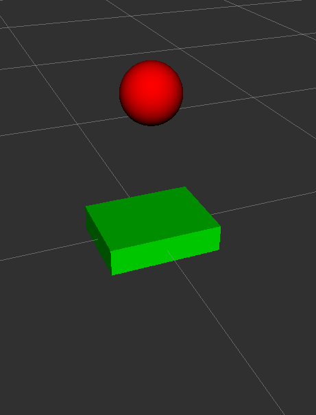

# 🤖 Mini Sentinel: ROS 2 Telemetry & Visualization

## 📝 Project Goal
The **Mini Sentinel** project is designed for the **ROS 2 Jazzy** environment. Its primary purpose is to demonstrate a real-time robot monitoring system (Telemetry). 

The system consists of a custom-designed robot (URDF) and a central logic unit (Brain Node) that broadcasts the robot's status into a 3D environment. This is essential for debugging and monitoring robots in industrial or research settings.

---

## 📸 Final Visualization
Below is the real-time telemetry output from RViz2, showing the robot model synchronized with the status markers.



---

## 🚀 Step-by-Step Execution Guide

### 1. Build the Workspace
Open your terminal and build the project to register all components:
```bash
cd ~/ros2_ws
colcon build --packages-select mini_sentinel
source install/setup.bash

### 2. Run the Telemetry Node
Launch the "Brain" of the robot to start publishing data:
```bash
ros2 run mini_sentinel brain_node

### 3.Launch Visualization (RViz2)
In a new terminal, run:
rviz2

### 4.Configuration for RViz2
To see the results as shown in the screenshot:

    Set Fixed Frame to base_link.

    Add RobotModel and set Description Source to File, then select robot.urdf.

    Add Marker and subscribe to the /robot_status topic.
